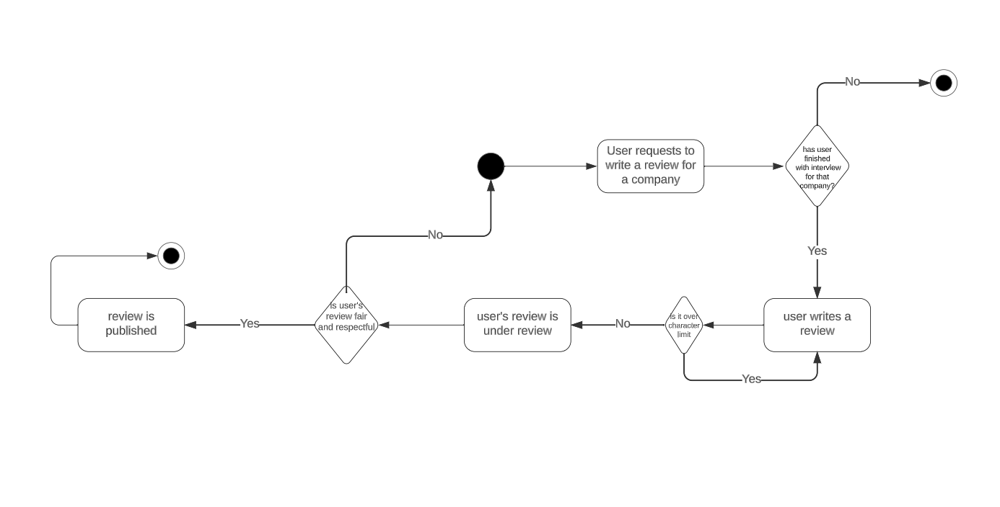

# Specification Phase Exercise

A little exercise to get started with the specification phase of the software development lifecycle. See the [instructions](instructions.md) for more detail.

## Team members

Samuel Shally: https://github.com/SamuelShally

Lemon Ruan: https://github.com/Lefie

Ana Sofia Pacheco: https://github.com/anaspacheco

## Stakeholders

See instructions. Delete this line and replace with the name(s) of the stakeholder(s) you interviewed and lists showing their goals/needs, and problems/frustrations.

**Stakeholders:** Nour Siwar, Faith Best, Maya Nesen, Mary White, Rosie, Rasagnya Reddy Kondam

Based on the responses from 6 interviewees, we found that: 

**Their goals**: 

- **Efficient Job Application Process:** 100% of respondents mentioned a goal of using a job board that streamlines the application process, allowing them to apply to multiple jobs without having to input their resume repeatedly. They also expressed interest in the feature of auto submitting applications
- **Job Suggestions**: 100% of respondents expressed an interest in receiving job suggestions based on their skills and preferences, making it easier to discover relevant job opportunities
- **Tailored Resumes**: 100% of respondents would appreciate tools that help them tailor their resumes effectively
- **Access to Detailed Company Profiles**: The majority of the respondents (68%) believed that having access to comprehensive company profiles, including culture, interviewing process, and compensation data, is important when applying for jobs.

**Their Frustrations:** 

- **Difficulty in Finding Referrals:** Job seekers find it challenging to locate referrals or connections within their desired companies, which can be crucial for getting their foot in the door.
- **Skill Matching Issues:** They encounter difficulties in matching their skills with specific job requirements due to variations in skill names, missing skills in job descriptions, and the need to sift through lengthy job postings to find relevant skills.
- **Dislike of Multiple Accounts:** Job seekers express their dislike for having to create multiple accounts with different usernames and passwords for each job application. This process is cumbersome and time-consuming.
- **Changing Resumes for Each Application:** Tailoring resumes for each job application is a time-consuming task that job seekers find frustrating. 

## Product Vision Statement

 To create a platform that matches tech workers with the right companies without all of the bloat of other job services, making it cleaner and easier to apply to a lot of listings.

## User Requirements

### Job Seeker 

**User Profile Creation**

- As a tech job seeker, I want to create a profile to demonstrate my job experiences, skillsets, and career goals so that I can be recommended appropriate job listings.

**Comprehensive Company Profiles**

- As a tech job seeker, I want detailed company profiles, including information about company culture, the interviewing process, and compensation data, to help me make informed decisions when considering job offers.

**Easy Access to Tech-Job Listings**

- As a tech job seeker, I want a single platform that aggregates tech-job listings from multiple sources, providing me with easy access to a wide range of tech-related job opportunities in one place.

**Save Favorite Job Listings**

- As a job seeker, I want to be able to add multiple job listings to a cart so I can apply to them easily

**Efficient Application Process**

- As a tech job seeker, I want to be able to apply to multiple jobs with a single click, without having to input my resume and details repeatedly, so that I can save time during the application process.

**Job Recommendations**

- As a tech professional, I want to receive personalized job recommendations based on my skills and preferences, so that I can discover relevant job opportunities more easily.

**Resume Customization**

- As a job seeker in the tech industry, I want access to a tool that helps me tailor my resume to match the specific requirements of different tech jobs and companies, making me a more competitive candidate.

***Job Application Status**

- As a job seeker, I want to be able to keep track of my application status so that I know if my application is rejected / under review or passed.

**Notification**

- As a job seeker, I want a notification system so that I can get updates about new listings, new application status, messages etc.

**Leaving a Review**

- As a job seeker, I want to be able to leave a review for a specific company after I finish interviewing for them to provide insights on the interview experience  so others can learn from my experience.

### Employer 

**Setting up Company Profile**

- As an employer, I want to set up a company profile to display insights about the organization that I work for. 

**View and Favorite Certain Candidates**

- As an employer, I want to be able to view applicants’ profiles and skillsets and favorite applicants that stand out.

**Messaging** 

- As an employer, I want to be able to reach out to strong candidates through direct messages so that we can move forward with the interview.

**Candidate Matching:**

- As an employer, I want to only see applicants who match the necessities of the job listing so that the company can avoid hiring under-qualified employees. 

## Activity Diagrams

**Resume Customization**

- As a job seeker in the tech industry, I want access to a tool that helps me tailor my resume to match the specific requirements of different tech jobs and companies, making me a more competitive candidate.

    

**Leaving a Review**

- As a job seeker, I want to be able to leave a review for a specific company after I finish interviewing for them to provide insights on the interview experience  so others can learn from my experience. 

    

## Clickable Prototype

[View Figma Design](https://www.figma.com/file/lyoRr4rvF3rnwcEFMzse79/Wireframe-for-job-matching?type=whiteboard&node-id=0-1&t=XAn7Kq5rdYmCXYqE-0)  
